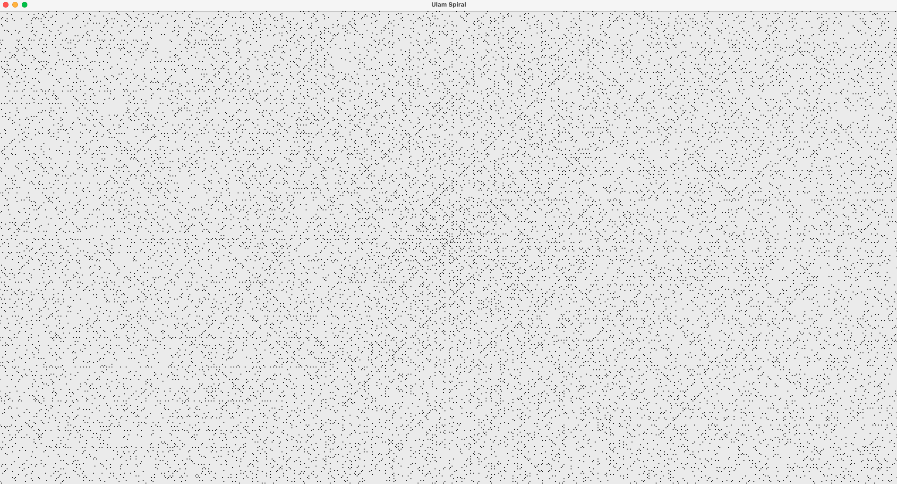

# Ulam Spiral

Simple Java Program generating an Ulam Spiral, a visualization of prime numbers in a spiral pattern.
It uses Java Swing to create a graphical user interface (GUI) window for displaying the spiral. 
It was made for GUI class at PJAIT

## Screenshot

## Prerequisites

- Java 21 or higher (LTS version recommended)

## Usage

### Cloning the Repository
``bash
git clone https://github.com/KalbarczykDev/java-swing-ulam-spiral.git
cd java-swing-ulam-spiral/src
``

### Building the Project
``bash
javac *.java
``
### Running the application
``bash
java Main
``
- Enter size of the spiral in prompt window.
- Wait for output.

## License
[MIT](https://choosealicense.com/licenses/mit/)

